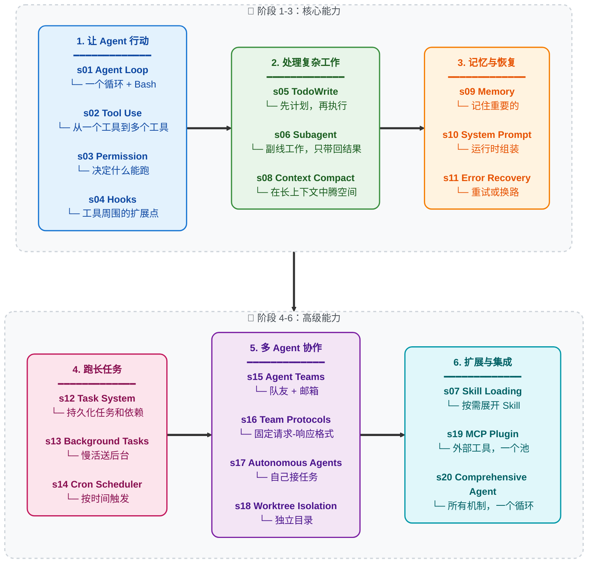

# Learn Claude Code — Harness 工程实践

> 📌 **学习分支**：本仓库是 [shareAI-lab/learn-claude-code](https://github.com/shareAI-lab/learn-claude-code) 的个人学习分支（`my-feature`），用于逐章学习 Agent Harness 的工程实现。目前已学完 **s01 ~ s06**。

---

## 学习进度

| 章节 | 主题 | 核心概念 | 状态 |
|------|------|----------|------|
| [s01](./s01_agent_loop/) | Agent Loop | `messages[]` / `while True` / `stop_reason` | ✅ 完成 |
| [s02](./s02_tool_use/) | Tool Use | `TOOL_HANDLERS` / 分发映射 / 工具扩展 | ✅ 完成 |
| [s03](./s03_permission/) | Permission | 三级权限管线 / 审批流程 | ✅ 完成 |
| [s04](./s04_hooks/) | Hook System | `PreToolUse` / `PostToolUse` / 扩展点 | ✅ 完成 |
| [s05](./s05_todo_write/) | TodoWrite | 计划先行 / nag 提醒 | ✅ 完成 |
| [s06](./s06_subagent/) | Subagent | 干净上下文 / 结果摘要 | ✅ 完成 |
| s07 ~ s20 | 后续章节 | — | ⏳ 待学习 |

## 本分支与原项目的主要差异

### 1. Windows 环境适配

原项目面向 Unix/Linux（默认使用 `bash`），本分支针对 **Windows (cmd.exe / PowerShell)** 做了适配：

| 章节 | 适配内容 |
|------|----------|
| s01 | `bash` 重命名为 `run_command`，底层调用 `cmd.exe`；危险命令黑名单替换为 Windows 对应项（`rmdir /s`、`del /f /s`、`format`、`reg delete` 等） |
| s02 | `safe_path()` 显式 `resolve()` 解决盘符大小写不一致（`c:\` vs `C:\`）；文件 I/O 显式 `encoding="utf-8"` 避免 GBK 乱码；`glob` 反斜杠转正斜杠 |
| s03~s06 | 继承上述全部适配 |

### 2. 功能模块拆分

原项目 `code.py` 将所有逻辑集中在单文件中。从 s04 开始，本分支将不同关注点拆到独立模块：

```
s04_hooks/                    s05_todo_write/               s06_subagent/
├── code.py     # 主循环     ├── code.py     # 主循环     ├── code.py      # 主循环
└── Tools/                   ├── Tools/                   ├── Tools/
    └── File_Handle.py           ├── File_Handle.py           ├── File_Handle.py
                                 └── Todo_write.py            ├── Todo_Write.py
                                                              ├── Sub_Task.py
                                                              └── Hooks/
                                                                  └── hooks.py
```

拆分原则：**每种工具独立为一个模块**（`Tools/`），**hooks 独立为一个模块**（`Hooks/`），`code.py` 只保留 agent loop 和入口逻辑。后续章节可直接复用，无需重复代码。

---

## 核心思想：Agency 来自模型，Agent = 模型 + Harness

**Agency — 感知、推理、行动的能力 — 来自模型训练，而非外部代码编排。** 但一个可工作的 Agent 产品需要模型和 Harness 两者兼备。模型是驾驶员，Harness 是载具。本仓库教你如何造车。

### 什么是 Harness

Harness 是模型在特定领域中运行所需的一切：

```
Harness = 工具 + 知识 + 观察 + 行动接口 + 权限

    工具(Tools)：      文件读写、Shell、网络、数据库、浏览器
    知识(Knowledge)：   产品文档、领域参考、API 规范、风格指南
    观察(Observation)： git diff、错误日志、浏览器状态、传感器数据
    行动(Action)：      CLI 命令、API 调用、UI 交互
    权限(Permissions)： 沙箱隔离、审批流程、信任边界
```

模型做决策，Harness 做执行。模型做推理，Harness 提供上下文。

### Harness 工程师做什么

- **实现工具** — 给 Agent 双手。文件读写、Shell 执行、API 调用、浏览器控制
- **管理知识** — 给 Agent 领域专长。按需加载，不预先塞入
- **管理上下文** — 给 Agent 干净的记忆。Subagent 隔离噪音，Context Compact 防止历史淹没当下
- **控制权限** — 给 Agent 边界。沙箱文件访问，破坏性操作需审批
- **收集轨迹数据** — Agent 的每一次行动序列都是训练信号，是微调下一代模型的原材料

你不是在写智能，你是在构建智能栖居的世界。把 Harness 造好，剩下的交给模型。

---

## 核心模式：Agent Loop

```
用户 --> messages[] --> LLM --> response
                                  |
                        stop_reason == "tool_use"?
                       /                          \
                    是                            否
                     |                             |
              执行工具                          返回文本
              追加结果
              回到 messages[]
```

```python
def agent_loop(messages):
    while True:
        response = client.messages.create(
            model=MODEL, system=SYSTEM,
            messages=messages, tools=TOOLS,
        )
        messages.append({"role": "assistant",
                         "content": response.content})

        if response.stop_reason != "tool_use":
            return

        results = []
        for block in response.content:
            if block.type == "tool_use":
                output = TOOL_HANDLERS[block.name](**block.input)
                results.append({
                    "type": "tool_result",
                    "tool_use_id": block.id,
                    "content": output,
                })
        messages.append({"role": "user", "content": results})
```

每一课在这个循环之上叠加一种 Harness 机制 — **循环本身从不改变**。

---

## 20 课概览

> **s01** *"一个循环 + Bash 就足够"* — 一个工具 + 一个循环 = 一个 Agent
>
> **s02** *"加一个工具就是加一个处理器"* — 循环不动，新工具注册到分发表
>
> **s03** *"先设边界，再给自由"* — 检查什么能跑、什么必须停、什么需要审批
>
> **s04** *"Hook 在循环周围，永远不改循环"* — 不改变主循环，添加扩展点
>
> **s05** *"没有计划的 Agent 会迷失"* — 先列步骤再执行，完成率翻倍
>
> **s06** *"大事化小，每个子任务有干净上下文"* — Subagent 做副线工作，只带回结果
>
> **s07** *"知识按需加载，不预先塞入"* — 先列出 Skill，展开时才加载
>
> **s08** *"上下文总会满 — 要有腾空间的办法"* — 多层压缩策略换无限会话
>
> **s09** *"记住重要的，忘记不重要的"* — 三个子系统：筛选、提取、固化
>
> **s10** *"提示词运行时组装，不硬编码"* — 按节拼接，按需加载
>
> **s11** *"错误不是终点，是重试的起点"* — 重试、腾空间、换路径
>
> **s12** *"大目标拆小任务，排序，落盘"* — 文件持久化的任务图，为多 Agent 协作打基础
>
> **s13** *"慢操作去后台，Agent 继续思考"* — 后台线程执行命令，完成时通知注入
>
> **s14** *"按计划触发，不需要人来踢"* — 按时间自动触发任务
>
> **s15** *"一个人搞不定 — 分配给队友"* — 常驻队友 + 异步邮箱
>
> **s16** *"队友需要共享的通信规则"* — 用固定的请求-响应格式协调
>
> **s17** *"队友自己看板、自己接任务"* — 不需要 Leader 逐一分配，自组织
>
> **s18** *"各干各的目录，互不干扰"* — 任务有目标，Worktree 有目录，按 ID 绑定
>
> **s19** *"能力不够？通过 MCP 外挂"* — 外部工具接入同一个工具池
>
> **s20** *"多种机制，一个循环"* — 所有机制回归一个完整的 Harness

---

## 学习路线

主线：行动 → 处理复杂工作 → 记忆与恢复 → 跑长任务 → 多 Agent 协作 → 扩展与集成。



---

## 所有章节

| 章节 | 主题 | 核心概念 |
|------|------|----------|
| [s01](./s01_agent_loop/) | Agent Loop | `messages[]` / `while True` / `stop_reason` |
| [s02](./s02_tool_use/) | Tool Use | `TOOL_HANDLERS` / 分发映射 / 工具扩展 |
| [s03](./s03_permission/) | Permission | 三级权限管线 / 审批流程 |
| [s04](./s04_hooks/) | Hook System | `PreToolUse` / `PostToolUse` / 扩展点 |
| [s05](./s05_todo_write/) | TodoWrite | 计划先行 / nag 提醒 |
| [s06](./s06_subagent/) | Subagent | 干净上下文 / 结果摘要 |
| [s07](./s07_skill_loading/) | Skill Loading | `SkillManifest` / 按需注入 |
| [s08](./s08_context_compact/) | Context Compact | snipCompact / microCompact / AutoCompact |
| [s09](./s09_memory/) | Memory | 筛选 / 提取 / 固化 |
| [s10](./s10_system_prompt/) | System Prompt | 运行时组装 / 按节拼接 |
| [s11](./s11_error_recovery/) | Error Recovery | Token 升级 / 降级模型 / 重试策略 |
| [s12](./s12_task_system/) | Task System | `TaskRecord` / `blockedBy` / 磁盘持久化 |
| [s13](./s13_background_tasks/) | Background Tasks | 线程执行 / 通知注入 |
| [s14](./s14_cron_scheduler/) | Cron Scheduler | 定时调度 / 会话级触发器 |
| [s15](./s15_agent_teams/) | Agent Teams | `MessageBus` / 收件箱 |
| [s16](./s16_team_protocols/) | Team Protocols | 关闭握手 / 计划审批 |
| [s17](./s17_autonomous_agents/) | Autonomous Agents | 空闲循环 / 自动接单 / 自组织 |
| [s18](./s18_worktree_isolation/) | Worktree Isolation | `WorktreeRecord` / 任务-目录绑定 |
| [s19](./s19_mcp_plugin/) | MCP Plugin | 多传输 / 通道路由 / 工具池组装 |
| [s20](./s20_comprehensive/) | Comprehensive | 所有机制围绕一个循环 |

---

## 如何阅读

每个章节是一个独立文件夹：

```
s08_context_compact/
  README.md       # 中文完整叙述（含内联代码）
  README.en.md    # 英文翻译
  README.ja.md    # 日文翻译
  code.py         # 独立可运行实现
  images/         # SVG 图示
```

按 s01 到 s20 顺序阅读。每章假设你已经读过前面章节，并以"下一章预告"结尾。

---

## 快速开始

```bash
git clone https://github.com/shareAI-lab/learn-claude-code
cd learn-claude-code
pip install -r requirements.txt
cp .env.example .env   # 配置 ANTHROPIC_API_KEY（或其他兼容 API）

# 从 s01 开始
python s01_agent_loop/code.py

# 学完所有章节后跑终点
python s20_comprehensive/code.py
```

> **Windows 用户注意**：本分支已针对 Windows 环境做了适配（`cmd.exe` 替代 `bash`、`utf-8` 编码等），可直接运行。详见上方「Windows 环境适配」部分。

---

## 项目结构

```
learn-claude-code/
  s01_agent_loop/          # 每章一个文件夹
    README.md              #   中文完整叙述
    README.en.md           #   英文翻译
    README.ja.md           #   日文翻译
    code.py                #   独立可运行代码
    images/                #   SVG 图示
  s02_tool_use/
  ...
  s20_comprehensive/       # 终点章节（所有机制的整合）
  agents/                  # 旧版 12 课可运行代码
  skills/                  # s07 用到的 Skill 文件
  docs/                    # 旧版 12 课文档
  web/                     # 旧版文档对应的 Web 展示
  tests/
```

---

## 学完之后

20 课学完，你将从内部理解 Harness 工程。两条路将知识转化为产品：

- **[Kode Agent CLI](https://github.com/shareAI-lab/Kode-CLI)** — 开源 Coding Agent 命令行工具，支持 Skill、LSP、Windows，兼容 GLM / MiniMax / DeepSeek 等开放模型。`npm i -g @shareai-lab/kode` 即可开始。
- **[Kode Agent SDK](https://github.com/shareAI-lab/kode-agent-sdk)** — 独立 Agent 库，无每用户进程开销。可嵌入后端、浏览器扩展、嵌入式设备等任何运行时。

---

## 姊妹教程

本仓库教授的 Harness 是**即用即弃**型的 — 打开终端，给 Agent 一个任务，完成后关闭。但 [OpenClaw](https://github.com/openclaw/openclaw) 证明了另一种可能：在同一个 Agent 核心上，增加两个 Harness 机制（心跳 + Cron），Agent 就能从"戳一下动一下"变成"每 30 秒自己醒来找活干"。

**[claw0](https://github.com/shareAI-lab/claw0)** 是姊妹教学仓库，从零拆解 Always-On Agent 的 Harness 机制。

---

## 许可

MIT

---

**Agency 来自模型，Harness 让 Agency 有处落脚。把 Harness 造好，剩下的交给模型。**

**这不是"抄源码"，这是"理解关键设计，然后自己造"。**
